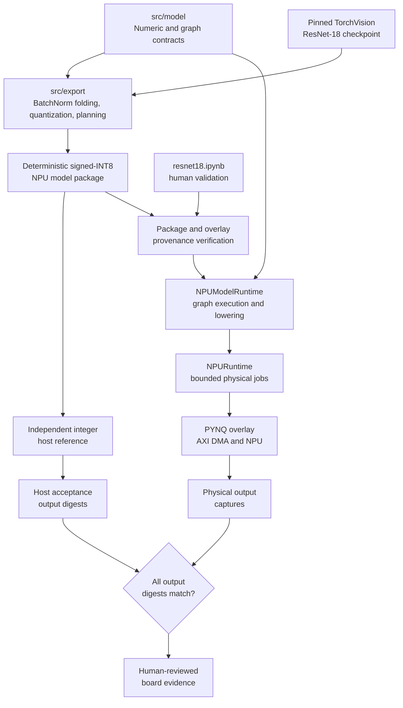
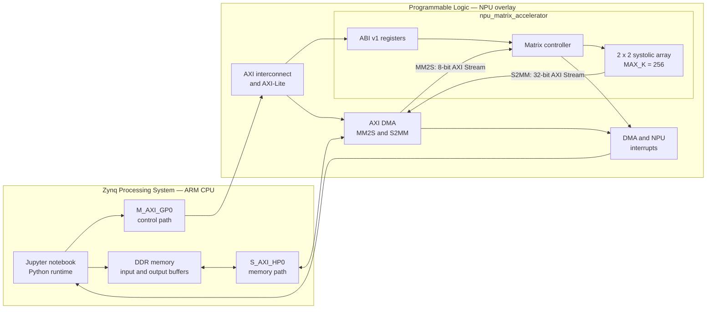

# NPU in PYNQ

[](https://github.com/yenhao-huang/npu_in_pynq/actions/workflows/ci.yml)
[](https://github.com/yenhao-huang/npu_in_pynq/releases)
[](LICENSE)


An open-source neural-network accelerator stack for the PYNQ-Z1. The project
connects bit-accurate quantized model contracts, deterministic export, a Python
runtime, DMA-driven FPGA execution, reproducible Vivado builds, and transparent
Jupyter notebook validation.

> Project status: research and development. Matrix multiplication is available
> as a standalone release. ResNet-18 import, export, runtime, and physical-board
> execution are implemented; strict same-commit release provenance and
> production hardening remain separate acceptance boundaries.

## What works today

| Capability | Status | Evidence |
| --- | --- | --- |
| Quantized numeric contract and hardware ABI | Available | Phase 0, Issue #2 / PR #12 |
| Processing elements and systolic-array RTL | Available | Phase 1A, Issue #3 / PR #13 |
| AXI DMA board vertical slice | Available | Phase 1B, Issue #4 / PR #17 |
| Tiled matrix multiplication | Released in v0.1.3 | Phase 1C, Issue #5 / PR #18 |
| Deterministic ResNet model package and runtime | Available in v0.1.4 candidate | Phase 2A, Issues #33–#36 |
| Pinned TorchVision ResNet-18 workflow | Host and physical development validation passed | Issues #7 and #47 / PRs #46 and #48 |

The ResNet path intentionally supports the pinned TorchVision ResNet-18 schema;
it does not claim support for arbitrary ONNX models, arbitrary ResNet variants,
or boards other than the PYNQ-Z1.

## Quick start

### Run the ResNet-18 workflow

The ResNet example deliberately separates host conversion, Vivado artifacts,
deployment, and human board acceptance. Follow the ordered
[ResNet-18 runbook](examples/resnet18/README.md) to:

1. create the conversion environment;
2. download and verify the pinned checkpoint;
3. convert and validate the signed-INT8 model package;
4. build or select the Vivado overlay;
5. copy the release to the PYNQ-Z1; and
6. inspect and approve each physical acceptance step in `resnet18.ipynb`.

## Verified physical ResNet-18 run

The human-reviewed notebook completed one full physical execution on the
PYNQ-Z1 on 2026-09-04:

| Measurement | Result |
| --- | --- |
| Physical matrix jobs | 2,104,040 |
| Elapsed time | 28,031.949 seconds (about 7 h 47 min) |
| Recorded output captures | 3 of 3 matched independent host digests |
| Evidence class | `physical-pynq-z1-development` |

The run explicitly allowed an artifact/source commit mismatch. It demonstrates
real FPGA execution and exact output agreement in development mode, but it is
not strict same-commit release evidence, an ImageNet accuracy result, or a
performance claim.

## Architecture

### Software architecture



The dependency direction is intentional: [`src/model/`](docs/manual/model.md)
defines shared numeric and graph contracts, `src/export/` produces the package,
`src/runtime/` validates and executes it, `src/hw/` implements the accelerator,
and `examples/` assembles human-facing workflows. Production modules never
import from examples.

### Hardware architecture



## Supported target and contracts

| Area | Supported boundary |
| --- | --- |
| Board | PYNQ-Z1 |
| FPGA part | Zynq-7020, `xc7z020clg400-1` |
| Overlay | `npu_matrix` with AXI DMA |
| Model source | Pinned TorchVision ResNet-18 `IMAGENET1K_V1` checkpoint |
| Arithmetic | Signed INT8 operands, exact INT16 products, saturating INT32 accumulation |
| Requantization | Q1.31 with explicit rounding and saturation contracts |
| Host tooling | Python and PowerShell; Vivado is required only for hardware builds |
| Board runtime | PYNQ Linux with the repository's Python runtime and notebook |

## Development

Run the open-source RTL gates from the repository root:

```bash
make -C src/test lint
make -C src/test sim
```

Run the Python regression suites:

```bash
python -m unittest discover -s src/test/tests -v
python -m unittest discover -s examples/matrix-multiplication/tests -v
python -m unittest discover -s examples/resnet18/tests -v
```

Vivado synthesis and implementation require a licensed local or self-hosted
environment:

```bash
vivado -mode batch -nojournal -nolog \
  -source src/hw/vivado_tcl/npu_matrix/build_overlay.tcl
```

GitHub-hosted CI runs Verilator lint and Icarus simulation. Publishing a stable
semantic-version release triggers the separately gated Vivado build and board
delivery workflow; bitstreams and generated Vivado projects are never committed.

## Documentation

- [ResNet-18 example](examples/resnet18/README.md)
- [Matrix multiplication example](examples/matrix-multiplication/README.md)
- [Production model contracts](docs/manual/model.md)
- [Repository rules](docs/rules/index.md)
- [Roadmap](docs/human/roadmap.md)
- [v0.1.3 changelog](changelog/v0.1.3.md)
- [v0.1.4 upload changelog](changelog/v0.1.4.md)

## Contributing

Development is issue-scoped and specification-driven. Read
[AGENTS.md](AGENTS.md) and the [Git rules](docs/rules/git/) before creating a
branch. Normal task pull requests target `dev`; promotion from `dev` to `main`
is a separate human release decision after the required validation evidence is
reviewed.

## License

Licensed under the [Apache License, Version 2.0](LICENSE).
