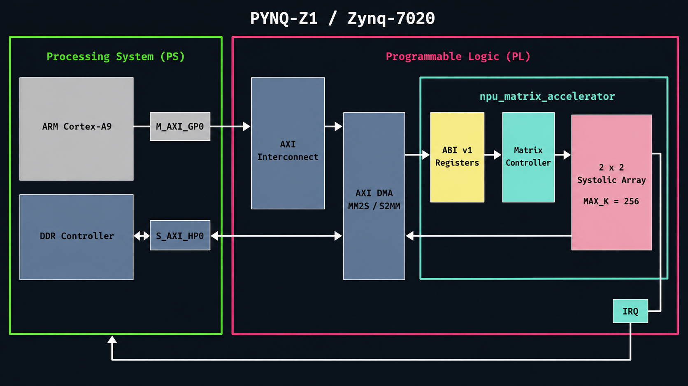

# NPU PYNQ

[](https://github.com/yenhao-huang/npu_in_pynq/actions/workflows/ci.yml)
[](https://github.com/yenhao-huang/npu_in_pynq/releases)
[](LICENSE)


An open-source neural-network accelerator stack for the PYNQ-Z1. The project
connects bit-accurate quantized model contracts, deterministic export, a Python
runtime, DMA-driven FPGA execution, reproducible Vivado builds, and transparent
Jupyter notebook validation.

> Project status: research and development. Matrix multiplication is available
> as a standalone release. ResNet-18 import, export, runtime, and physical-board
> execution are implemented; strict same-commit release provenance and
> production hardening remain separate acceptance boundaries.

## Contents

- [Features](#features)
- [Quick Start](#quick-start)
- [Design Flow of NPU PYNQ](#design-flow-of-npu-pynq)
- [Hardware Architecture](#hardware-architecture)
- [Supported target and contracts](#supported-target-and-contracts)
- [Experiment Results](#experiment-results)
- [Agentic Components](#agentic-components)
- [Documentation](#documentation)
- [Contributing](#contributing)
- [License](#license)

## Features

| Capability | Status |
| --- | --- |
| Support Quantized ResNet-18 | Done |
| Customized EDA Tools | Done |
| Transformers | Undone |
| RTL Optimization by Design Space Exploration | Undone |

The ResNet path intentionally supports the pinned TorchVision ResNet-18 schema;
it does not claim support for arbitrary ONNX models, arbitrary ResNet variants,
or boards other than the PYNQ-Z1.

## Quick Start

1. Download the package on your computer:
   [npu-resnet18-v1.0.6.zip](https://github.com/yenhao-huang/npu-pynq/releases/download/v1.0.6/npu-resnet18-v1.0.6.zip).
2. Copy it to the PYNQ-Z1:

   ```bash
   scp npu-resnet18-v1.0.6.zip xilinx@192.168.2.99:~/jupyter_notebooks/
   ```

3. Log in to the board:

   ```bash
   ssh xilinx@192.168.2.99
   ```

4. Extract the package:

   ```bash
   cd ~/jupyter_notebooks
   unzip npu-resnet18-v1.0.6.zip -d npu-resnet18
   ```

5. Open the notebook in Jupyter at
   <http://192.168.2.99:9090/notebooks/npu-resnet18/resnet18.ipynb> and run the
   cells in order. Pick a bundled picture or upload your own; the last cell
   prints the top-5 ImageNet labels, their scores, and a CORRECT or INCORRECT
   verdict.

## Design Flow of NPU PYNQ

```text
                                      +-------------------+
                                      | Vivado toolchains |
                                      +------^-------+----+
                                             |       |
                                        +----+-------v----+
                     +----------------+ |                 |
                     | TorchVision    +->                 |
                     | ResNet-18      | |                 |       Matrix and ResNet-18
                     +----------------+ |   NPU in PYNQ   +------> workloads ready to run
                                        |                 |       on the PYNQ-Z1
          +---------------------------+ |                 |
          | NPU stack ecosystem      +->                 |
          +---------------------------+ +---^----------^--+
          (model contracts, export,        |          |
           runtime, DMA, RTL, demos)        +          +
                                        PYNQ-Z1   npu_matrix
                                          board      target
```

[`src/model/`](docs/manual/model.md)
defines shared numeric and graph contracts, `src/export/` produces the package,
`src/runtime/` validates and executes it, `src/hw/` implements the accelerator,
and `examples/` assembles human-facing workflows. Production modules never
import from examples.

## Hardware Architecture



The diagram is limited to the physical hardware path: the Zynq processing
system reaches the programmable logic through its AXI control and memory
ports, while AXI DMA streams operands through the matrix controller and the
2 x 2 systolic array.

## Supported target and contracts

| Area | Supported boundary |
| --- | --- |
| Board | PYNQ-Z1 |
| FPGA part | Zynq-7020, `xc7z020clg400-1` |
| Overlay | `npu_matrix` with AXI DMA |
| Model source | Pinned TorchVision ResNet-18 `IMAGENET1K_V1` checkpoint |
| Arithmetic | Signed INT8 operands, exact INT16 products, saturating INT32 accumulation |
| Requantization | Q1.31 with explicit rounding and saturation contracts |
| Host tooling | Python and PowerShell; Vivado is required only for hardware builds |
| Board runtime | PYNQ Linux with the repository's Python runtime and notebook |

## Experiment Results

The human-reviewed notebook completed one full physical execution on the
PYNQ-Z1 on 2026-09-04:

| Measurement | Result |
| --- | --- |
| Physical matrix jobs | 2,104,040 |
| Elapsed time | 28,031.949 seconds (about 7 h 47 min) |
| Recorded output captures | 3 of 3 matched independent host digests |
| Evidence class | `physical-pynq-z1-development` |

The run explicitly allowed an artifact/source commit mismatch. It demonstrates
real FPGA execution and exact output agreement in development mode, but it is
not strict same-commit release evidence, an ImageNet accuracy result, or a
performance claim.

## Agentic Components

### IC design tools

Give Claude Code, Codex, pi-agent and other compatible agents tools for RTL
linting, simulation, waveform debugging and synthesis. Install in Linux/WSL
or macOS with Node.js 20.11+:

```bash
npm install -g --foreground-scripts @jony2156/ai-eda-tools@0.1.0
ic-tools doctor
```

Connect Claude Code from your project root:

```bash
claude mcp add --transport stdio --scope project ic-tools -- \
  "$(command -v ic-tools)" serve --project "$PWD"
claude mcp list
claude
```

See the [tool guide](tools/ic/README.md) for capabilities and
[agent installation guide](tools/ic/docs/manual/installation.md) for Codex, pi
and environment requirements.

### EDA skills

[`.codex/skills/`](.codex/skills/) provides reusable development, deployment
and IC design workflows, including hardware builds and PYNQ board delivery.
Skills guide the agent's workflow; tools execute the design operations.

### Harness Engineering

- **Agent instructions:** [AGENTS.md](AGENTS.md) and [CLAUDE.md](CLAUDE.md)
  define repository context and working rules.
- **Git management:** [docs/rules/git/](docs/rules/git/) defines issue,
  branch, commit and pull-request workflows.
- **Environment and structure:** [environment.md](docs/rules/environment.md)
  and [filetree.md](docs/rules/filetree.md) define tool assumptions and where
  source, tests and generated artifacts belong.
- **Spec-Driven Development:** use the OpenSpec skills to propose, implement
  and archive changes under [openspec/](openspec/).

## Documentation

- [ResNet-18 example](examples/resnet18/README.md)
- [Matrix multiplication example](examples/matrix-multiplication/README.md)
- [Production model contracts](docs/manual/model.md)
- [Repository rules](docs/rules/index.md)
- [Roadmap](docs/human/roadmap.md)
- [v0.1.3 changelog](changelog/v0.1.3.md)
- [v0.1.4 upload changelog](changelog/v0.1.4.md)

## Contributing

Development is issue-scoped and specification-driven. Read
[AGENTS.md](AGENTS.md) and the [Git rules](docs/rules/git/) before creating a
branch. Normal task pull requests target `dev`; promotion from `dev` to `main`
is a separate human release decision after the required validation evidence is
reviewed.

## License

Licensed under the [Apache License, Version 2.0](LICENSE).
